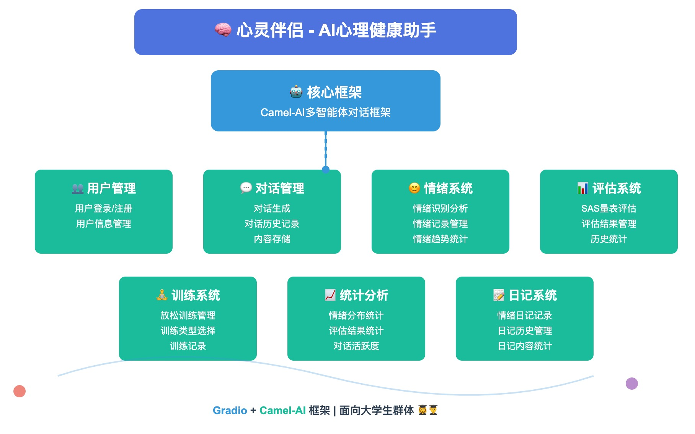
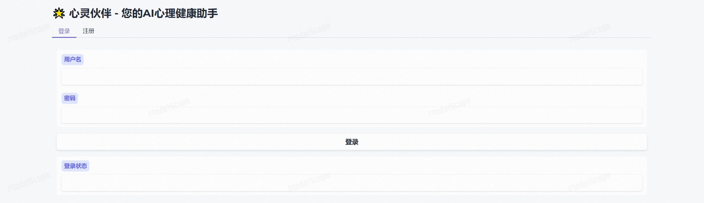
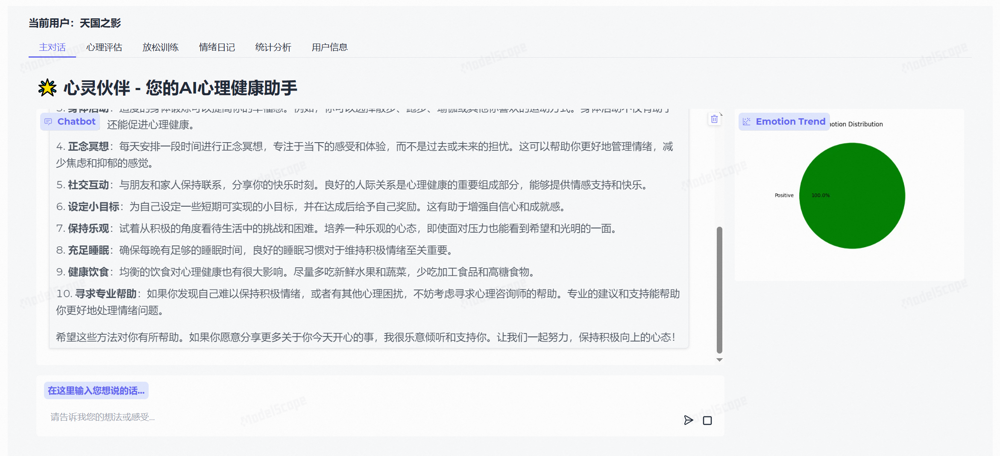

# ResonantSoul 

心灵伴侣-您的AI心理健康助手，这是一个基于Gradio和Camel-AI框架构建的心理健康智能体系统，主要面向大学生群体，提供心理咨询和支持服务。系统的核心是基于Camel-AI的多智能体对话框架，通过角色扮演实现专业的心理咨询功能。



**功能列表：**
1. 用户管理：用户登录、用户注册、用户信息管理
2. 对话管理：对话生成、对话历史记录、对话内容存储
3. 情绪系统：情绪识别分析、情绪记录管理、情绪趋势统计
4. 评估系统：SAS量表评估、评估结果管理、评估历史统计
5. 训练系统：放松训练内容管理、训练类型选择、训练记录管理
6. 统计分析：情绪分布统计、评估结果统计、对话活跃度分析
7. 日记系统：情绪日记记录、日记历史管理、日记内容统计

## 魔搭演示环境地址

https://modelscope.cn/studios/Datawhale/resonant-soul/summary





## 环境安装

1. 基础环境：Python3.10+

2. 安装UV
```shell
pip install uv
set UV_INDEX=https://mirrors.aliyun.com/pypi/simple
```

3. 安装Python依赖包
```shell
uv sync --python 3.10 --all-extras
```

4. 切换到本地环境(.venv)
```shell
cd .venv/Scripts
activate
```

## 启动项目
1. 在conf路径中，配置系统文件`service_conf.yaml`

```yaml
llm:
  model_type: 'Qwen/Qwen2.5-7B-Instruct'
  model_url: 'https://api.siliconflow.cn/v1/'
  api_key: 'your-api-key'
```

2. 启动项目

```shell
python app.py
```

3. 访问项目：

用户界面访问地址：http://127.0.0.1:5760

## 项目部署

1. 依赖文件生成（新添加依赖包需要重新生成）

由于魔搭创空间只能支持requirements.txt的pip依赖文件，需要用uv生成项目依赖文件。
```shell
uv pip compile pyproject.toml --all-extras -o requirements.txt
```

**注：需要注释掉`pywin32==311`这一行。**'

2. 基于魔搭创空间部署：

将项目上传到魔搭创空间的Git代码仓库中，然后在`设置`里点击上线发布即可。

3. Docker环境部署

```shell
docker build -t resonant-soul:v1.0 .
docker run -p 7860:7860 --name resonant-soul resonant-soul:v1.0
```

## 致谢

**核心贡献者**
- [胡锐锋-项目负责人](https://github.com/Relph1119) （Datawhale成员-系统架构设计师）
- [陈思州-项目负责人](https://github.com/jjyaoao) （Datawhale成员）

**其他**
1. 特别感谢 [@Sm1les](https://github.com/Sm1les)、[@LSGOMYP](https://github.com/LSGOMYP) 对本项目的帮助与支持；

## 关注我们

<div align=center>
<p>扫描下方二维码关注公众号：Datawhale</p>

</div>